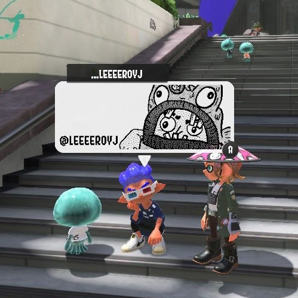
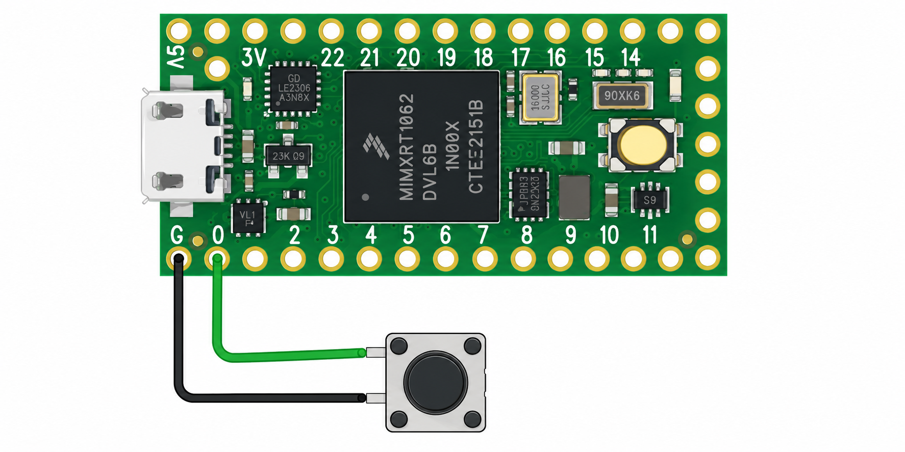
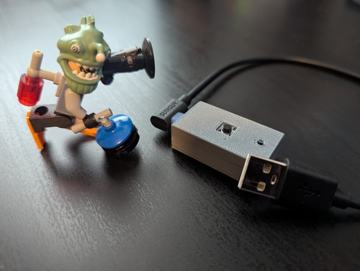
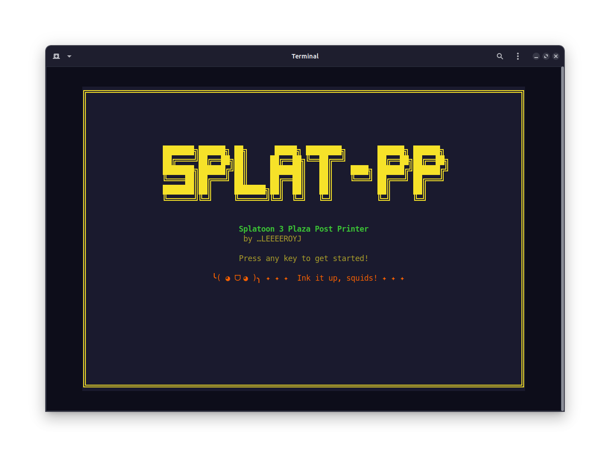

# splat-pp - Splatoon 3 Post Printer

Convert black-and-white PNG images into Arduino sketches that are automatically drawn on Splatoon 3's Plaza Post canvas.



 

---

## How it works

A Teensy 4.0 microcontroller is used to emulate a Nintendo Switch Pro Controller (Hori HoriPAD S) and run a macro to control the brush tool and draw on the canvas. 

`splat-pp.py` reads a 320×120 pixel B&W PNG and converts it into a sequence of D-Pad moves and A button presses that trace every black pixel on the canvas.

The drawing sequence is encoded as a fcompact bytecode array stored in the Arduino sketch's flash memory (`PROGMEM`). A small interpreter loop (~30 lines of C) reads and executes each opcode at runtime. Even a fully dense image produces only ~70 KB of data and a few hundred bytes of machine code, well within the Teensy 4.0's limits.

The drawing is combined with a sketch template that handles registering the controller with the Switch, setting up the canvas for a new drawing, and saving the post after the drawing is complete. The sketch gets compiled and flashed on the Teensy. 

---

## Requirements

### Hardware

- Teensy 4.0 microcontroller
- USB cable (Teensy → Nintendo Switch or PC)
- A momentary push button wired between GPIO pin 0 and GND (or bridge the pins directly)
  

You can just bridge the connection to 0 and GND when you want to kick off the macro, or you can hook up the momentary button. I 3d printed a basic enclosure for mine. I used a small piece of extra filament with one side melted and flattend down for the programming button. 



### Software

- Ubuntu/Debian Linux
- Python 3.11+
- Git
- `arduino-cli`
- `teensy_loader_cli`
- Python packages: `pillow`, `numpy`, `textual`

```bash
pip install pillow numpy textual
```
---

## Setup

Run the setup script once. It installs and patches everything needed to compile and flash sketches from the command line. No Arduino IDE required!

```bash
chmod +x setup-nsgadget.sh
./setup-nsgadget.sh
```

The script is safe to re-run. Each step is guarded and skipped if already complete.

### What the script does

1. Installs `arduino-cli`
2. Configures `arduino-cli` to use `~/Arduino` as its data directory
3. Installs the Teensy 4.0 core (v1.60.0)
4. Clones [dmadison/NSGadget_Teensy](https://github.com/dmadison/NSGadget_Teensy)  - Provides the USB HID descriptor files that make the Teensy appear as a Hori HoriPAD S controller
5. Installs the `Bounce2` library
6. Copies the NSGamepad USB descriptor files (`usb_nsgamepad.c/h`, `usb_desc.c/h`, `usb_inst.cpp`) into the Teensy core
7. **Surgically patches `boards.txt`** - appends only the `usb=nsgamepad` USB type entry, preserving the stock `gnu++17` compiler flags that Teensy core 1.60.0 requires
8. **Patches `usb.c`** — adds the missing `usb_nsgamepad_configure()` call to the USB configuration callback. Without this, the HID endpoint never opens and no button reports are sent even though the controller is recognized
9. Patches `WProgram.h` to include `usb_nsgamepad.h`
10. Patches `Print.cpp` and `yield.cpp` to disable Serial references in NSGamepad USB mode
11. Installs Teensy udev rules (allows flashing without `sudo`)
12. Installs `teensy_loader_cli`

> **Note:** After running the script for the first time, log out and back in (or reboot) for the udev rules to take effect.

---

## Usage

### TUI

```
python splat-pp-tui.py
```

Press any key on the spash screen and then follow the prompts to flash! The TUI expects your source images to be in the img/ directory.


### The 1 Liner

```
python splat-pp.py <image.png> [--duration <ms>] [--template <file>]
```

| Argument | Default | Description |
|----------|---------|-------------|
| `image.png` | — | Source image (PNG, ideally 320×120) |
| `--duration` | `25` | Milliseconds per action (range: 20–200) |
| `--template` | `sketch.txt` | Path to Arduino sketch template |

The script handles everything in one run:

1. Converts the image to a bytecode sequence
2. Merges it with the sketch template
3. Compiles the sketch with `arduino-cli`
4. Prompts you to put the Teensy into flash mode, then flashes it

The default sketch.txt template can be copied and adjusted as needed:

   - Define Controller Settings
   - Registers the controller with the Switch (3× A press)
   - Select the smallest pen size (2× L press)
   - Clear the canvas (L-stick click)
   - Move the cursor to the top-left corner (analog stick held for 7 seconds)
   - Bytecode sequence
   - Save and exit (Minus press)

### Example

```bash
python splat-pp.py img/myimage.png
```

Output:
```
Loading image: img/myimage.png
  Black pixels: 22,750 / 38,400
Planning snake-scan move sequence...
  Draw operations: 22,750
Encoding bytecode...
  Bytecode size : 68,318 bytes
  Est. draw time: 3056s (50.9 min)
Merging with template...
  Written to: sketch/myimage/myimage.ino

Compiling myimage...
  Sketch uses 45404 bytes (2%) of program storage space. Maximum is 2031616 bytes.
  Compile successful.

─────────────────────────────────────────
  Ready to flash.
  Press the button on your Teensy, then
  press Enter here to flash...
─────────────────────────────────────────

Cleaning up build directory...

Done! Connect your Teensy to the Switch and head to the plaza post printer!
```

---

## Using it with Splatoon 3

1. In Splatoon 3, open the **Plaza Post Printer** and start a new post
2. Press the **sync button** on your real controller to disconnect it.  The controller pairing screen will appear.
3. Plug the Teensy into the Switch via USB
4. Press the **button wired to GPIO pin 0** on the Teensy **once**
5. The macro will run and automatically:
   - Register the controller with the Switch (3× A press)
   - Select the smallest pen size (2× L press)
   - Clear the canvas (L-stick click)
   - Move the cursor to the top-left corner (analog stick held for 7 seconds)
   - Draw your image
   - Save and exit (Minus press)
6. When finished, disconnect the Teensy and reconnect your real controllers
7. Head back to the Post Printer to review and share your post

---

## Image requirements

- **Format:** PNG
- **Dimensions:** 320×120 pixels (other sizes are resized automatically)
- **Color:** Pure black (`#000000`) pixels are drawn; white pixels are skipped
- **Grayscale** input is accepted and thresholded at 50% brightness automatically

For best results, prepare your image at exactly 320×120 in an image editor and convert to 1-bit B&W before running the script.

Vertical images can be rotated after they are drawn on the canvas. You can "print" them horizontally, with the bottom of the vertical image on the left, and then rotate after printing. 


---

## Timing

The `--duration` parameter controls how long each D-Pad tap or button press is held (in milliseconds). Lower values draw faster but may cause missed inputs.

| Duration | Reliability | ~Draw time (half-filled canvas) |
|----------|-------------|----------------------------------|
| 20ms | Marginal | ~25 min |
| 25ms | Good (default) | ~30 min |
| 50ms | Very reliable | ~60 min |

Draw time scales with the number of black pixels. A fully filled 320×120 canvas at 25ms takes roughly 50–60 minutes.

---

### Drawing strategy

Pixels are visited using a "snake scan" (boustrophedon): left-to-right on even rows, right-to-left on odd rows. This minimizes total cursor travel and keeps draw time as short as possible.

### Bytecode format

Each instruction is 1–2 bytes:

| Opcode | Hex | Arguments | Action |
|--------|-----|-----------|--------|
| `OP_DRAW` | `0x00` | — | Press A (stamp pixel) |
| `OP_UP` | `0x01` | `n` (1 byte) | Move cursor up n steps |
| `OP_DOWN` | `0x02` | `n` (1 byte) | Move cursor down n steps |
| `OP_LEFT` | `0x03` | `n` (1 byte) | Move cursor left n steps |
| `OP_RIGHT` | `0x04` | `n` (1 byte) | Move cursor right n steps |

Moves larger than 255 steps are split into multiple instructions automatically.

---

Made with 🧡 & 🤖